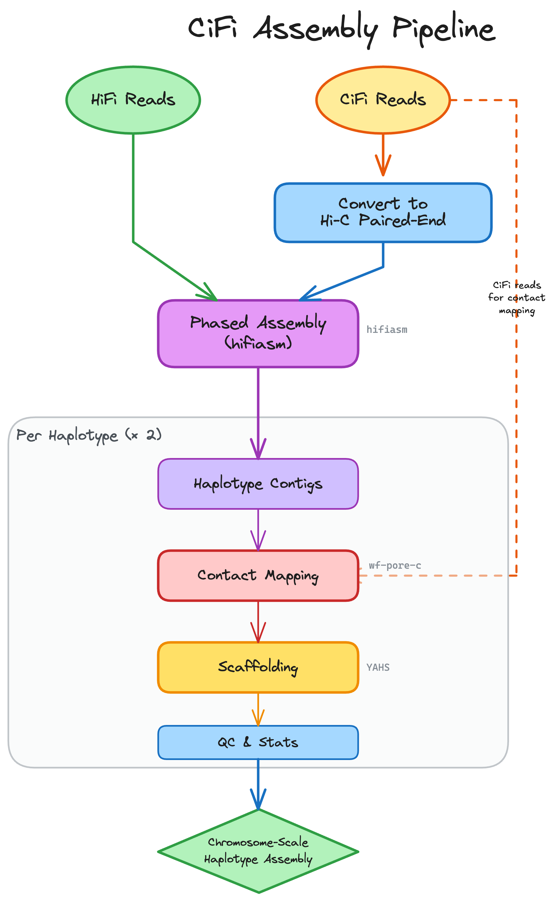

# CiFi Assembly Workflow (active development)

A Snakemake pipeline for generating chromosome-scale, phased de novo assemblies using HiFi long reads and CiFi (Long-reads Chromatin Conformation Capture) data.

## Overview

This pipeline takes HiFi and CiFi BAM files as input and produces haplotype-resolved, scaffold-level assemblies with QC metrics and contact maps.


## Workflow Diagram




## Configuration

Edit `config.example.yaml` to specify:

### Samples
```yaml
samples:
  my_sample:
    hifi_bam: /path/to/hifi_reads.bam   # PacBio HiFi reads
    cifi_bam: /path/to/cifi_reads.bam   # CiFi reads
    enzyme: HindIII                      # Restriction enzyme 
```

### Dilution (optional)
```yaml
dilution:
  enabled: false                    # Use 100% CiFi reads
  percentages: [20, 40, 60, 80, 100]  # Or test multiple coverage levels
```

### Tool Paths
```yaml
tools:
  singularity_cache: /path/to/cache  # For Nextflow containers
```


## Output Files

```
cifi_assembly/
├── hifi/
│   └── {sample}.hifi.fa              # HiFi reads as FASTA
├── cifi/
│   └── {sample}.{pct}.bam            # Downsampled CiFi BAM
├── cifi2pe/
│   └── {sample}.{pct}_HiC_R*.fastq   # Hi-C-like paired reads
├── asm/{sample}/{pct}/
│   ├── *.hic.hap{1,2}.p_ctg.gfa      # hifiasm contigs (GFA)
│   └── *.hap{1,2}.fa                 # Contigs (FASTA)
├── porec/{sample}/{pct}/hap{1,2}/
│   ├── *.bed                         # Pore-C contacts
│   ├── *.pairs.gz                    # Contact pairs
│   ├── *.mcool                       # Multi-resolution contact matrix
│   └── *.hic                         # Juicebox-compatible Hi-C file
├── yahs/{sample}/{pct}/
│   ├── *_scaffolds_final.fa          # Final scaffolds
│   └── *_scaffolds_final.agp         # Scaffold AGP
├── qc_porec/{sample}/{pct}/hap{1,2}/
│   ├── *.hic                         # QC contact map
│   └── *.cs.bam                      # Aligned CiFi reads
└── stats/{sample}/{pct}/
    ├── summary.tsv                   # Contig assembly stats
    └── yahs_summary.tsv              # Scaffold stats
```

## Workflow Rules (15 total)

| Rule | Description |
|------|-------------|
| `hifi_fasta` | Convert HiFi BAM to FASTA |
| `downsample_cifi_bam` | Downsample CiFi reads to target percentage |
| `cifi_fastq_from_downsampled_bam` | Extract FASTQ from CiFi BAM |
| `cifi2pe_split` | Split CiFi reads at restriction sites to Hi-C-like PE |
| `hifiasm_dual_scaf` | Assemble with hifiasm --dual-scaf |
| `gfa2fa` | Convert GFA to FASTA |
| `caln50` | Calculate N50 and other stats |
| `summarize_assembly` | Compile contig assembly statistics |
| `porec_nextflow` | Run wf-pore-c for contact mapping |
| `index_fa` | Index FASTA with samtools |
| `yahs_scaffold` | Scaffold with YAHS |
| `yahs_caln50` | Calculate scaffold statistics |
| `summarize_yahs` | Compile scaffold statistics |
| `yahs_index_scaffolds_fa` | Index scaffold FASTA |
| `qc_porec_nextflow` | QC by mapping CiFi to scaffolds |


## Scripts

This workflow uses the following external scripts:

- `scripts/cifi2pe_full_length.py` - Splits CiFi reads at restriction enzyme sites
  Source: [CiFi2PE](https://github.com/sheinasim-USDA/CiFi2PE) by Sheina Sim (USDA)

- `scripts/calN50.js` - Calculates N50 and assembly statistics (requires k8)
  Source: [calN50](https://github.com/lh3/calN50) by Heng Li

