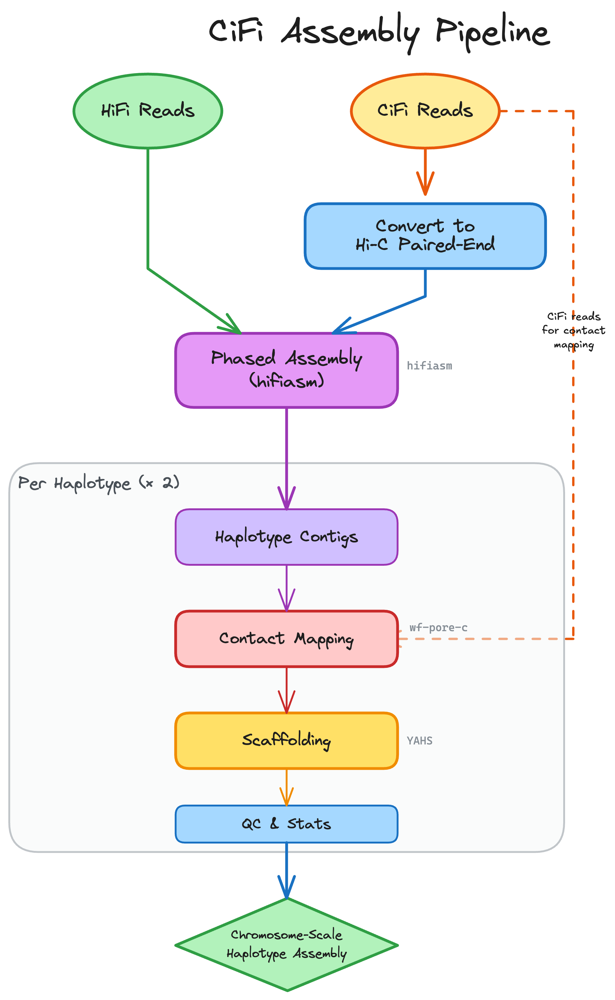

# CiFi Assembly Workflow (active development)

A Snakemake pipeline for generating chromosome-scale, phased de novo assemblies using HiFi long reads and CiFi (Long-reads Chromatin Conformation Capture) data, with support for manual curation via Juicebox Assembly Tools (JBAT).

## Overview

This pipeline takes HiFi and CiFi reads (BAM or FASTQ) as input and produces haplotype-resolved, scaffold-level assemblies with QC metrics, contact maps, and editable `.hic` files for manual curation in Juicebox.


## Workflow Diagram




## Prerequisites

### Dependencies

Managed via conda (`environment.yaml`). Key tools: snakemake, samtools, hifiasm, gfatools, yahs, k8, nextflow, cifi (PyPI), biopython, numpy, pairix.

### 3D-DNA (required for JBAT)

Included as a git submodule. After cloning this repo:

```bash
git submodule update --init --recursive
```

### JuicerTools JAR (required for JBAT)

Download the JuicerTools JAR file:

```bash
wget https://github.com/aidenlab/JuicerTools/releases/download/v3.0.0/juicer_tools.jar -O juicer_tools.3.0.0.jar
```


## Configuration

Copy `config.example.yaml` to `config.yaml` and edit:

```bash
cp config.example.yaml config.yaml
```

### Samples
```yaml
samples:
  my_sample:
    hifi_bam: /path/to/hifi_reads.bam      # PacBio HiFi reads
    cifi: /path/to/cifi_reads.bam           # CiFi reads (BAM or FASTQ/FASTQ.GZ)
    enzyme: HindIII                         # Restriction enzyme (HindIII, DpnII, NlaIII)
```

### Dilution (optional)
```yaml
dilution:
  enabled: false                    # Use 100% CiFi reads
  percentages: [20, 40, 60, 80, 100]  # Or test multiple coverage levels
```

### Tool Paths
```yaml
tools:
  singularity_cache: /path/to/cache         # For Nextflow containers
  threed_dna: "./3d-dna"                    # Path to 3D-DNA repository
  juicer_tools_jar: "./juicer_tools.3.0.0.jar"  # Path to JuicerTools JAR
```

### CiFi toolkit options (optional)
```yaml
cifi:
  qc:
    num_reads: 0         # reads to sample for QC (0 = all)
    min_sites: 1         # min enzyme sites to count a read as usable
  digest:
    min_fragments: 3     # min fragments per read to keep (-m)
    min_frag_len: 20     # min fragment length bp (-l)
    strip_overhang: true # default: strip enzyme overhang from R2
    gzip: false          # gzip-compress R1/R2 output
    fast: false          # streaming stats (lower memory)
```
See the [cifi toolkit](https://pypi.org/project/cifi/) docs for details. To use a custom restriction site instead of a named enzyme, set `site` + `cut_pos` under the sample entry.

### SLURM (optional)
```yaml
slurm:
  partition: "low"       # SLURM partition name
  account: "publicgrp"   # SLURM account name
```

## Running

```bash
conda activate vole

# Dry run (validate DAG)
snakemake --dry-run

# Run locally
snakemake --cores 32

# Run on SLURM cluster
snakemake --cores 32 --slurm

# Run specific target
snakemake stats/my_sample/100/summary.tsv         # contig stats only
snakemake stats/my_sample/100/yahs_summary.tsv    # scaffold stats only
```


## Output Files

```
cifi_assembly/
├── qc_cifi/{sample}/
│   └── qc.pdf                            # CiFi QC report
├── hifi/
│   └── {sample}.hifi.fa                  # HiFi reads as FASTA
├── cifi/
│   └── {sample}.{pct}.bam               # Downsampled CiFi BAM
├── cifi2pe/
│   └── {sample}.{pct}_R{1,2}.fastq      # Hi-C-like paired reads
├── asm/{sample}/{pct}/
│   ├── *.hic.hap{1,2}.p_ctg.gfa         # hifiasm contigs (GFA)
│   └── *.hap{1,2}.fa                    # Contigs (FASTA)
├── porec/{sample}/{pct}/hap{1,2}/
│   ├── *.bed                            # Pore-C contacts
│   ├── *.pairs.gz                       # Contact pairs
│   ├── *.mcool                          # Multi-resolution contact matrix
│   └── *.hic                            # Hi-C contact map
├── yahs/{sample}/{pct}/
│   ├── *_scaffolds_final.fa             # Final scaffolds
│   └── *_scaffolds_final.agp            # Scaffold AGP
├── qc_porec/{sample}/{pct}/hap{1,2}/
│   ├── *.hic                            # QC contact map
│   └── *.cs.bam                         # Aligned CiFi reads
├── jbat/{sample}/{pct}/hap{1,2}/
│   ├── *.hic                            # Editable Hi-C map for Juicebox
│   ├── *.assembly                       # Assembly file for JBAT
│   └── merged_nodups.txt                # Contact data (3D-DNA format)
└── stats/{sample}/{pct}/
    ├── summary.tsv                      # Contig assembly stats
    └── yahs_summary.tsv                 # Scaffold stats
```

## Manual Curation with JBAT

After the pipeline completes, use Juicebox Assembly Tools for manual curation:

1. Open `jbat/{sample}/{pct}/hap{hap}/{sample}.{pct}.hap{hap}.hic` in [Juicebox](https://github.com/aidenlab/Juicebox)
2. Load the `.assembly` file via **Assembly > Import Map Assembly**
3. Review and correct scaffold joins/orientations
4. Export the corrected assembly as `{sample}.{pct}.hap{hap}.review.assembly`
5. Run the post-review rule to generate the final FASTA:
   ```bash
   snakemake jbat/{sample}/{pct}/hap{hap}/{sample}.{pct}.hap{hap}.FINAL.fa
   ```


## Workflow Rules

| Rule | Description |
|------|-------------|
| `cifi_qc` | QC report on raw CiFi input (via `cifi qc`) |
| `cifi_fastq_to_bam` | Convert CiFi FASTQ to BAM (if needed) |
| `hifi_fasta` | Convert HiFi BAM to FASTA |
| `downsample_cifi_bam` | Downsample CiFi reads to target percentage |
| `cifi_fastq_from_downsampled_bam` | Extract FASTQ from CiFi BAM |
| `cifi2pe_split` | Digest CiFi reads into Hi-C-like PE reads (via `cifi digest`) |
| `hifiasm_dual_scaf` | Assemble with hifiasm --dual-scaf |
| `gfa2fa` | Convert GFA to FASTA |
| `caln50` | Calculate N50 and other stats |
| `summarize_assembly` | Compile contig assembly statistics |
| `porec_nextflow` | Run wf-pore-c for contact mapping |
| `index_fa` | Index FASTA with samtools |
| `yahs_scaffold` | Scaffold with YAHS |
| `yahs_caln50` | Calculate scaffold statistics |
| `summarize_yahs` | Compile scaffold statistics |
| `yahs_index_scaffolds_fa` | Index scaffold FASTA |
| `qc_porec_nextflow` | QC by mapping CiFi to scaffolds |
| `cifi_filter_bam` | Filter paired-end BAM for JBAT |
| `generate_genome_file` | Generate chromosome sizes file |
| `bam2pairs` | Convert BAM to pairs format |
| `pairs_to_mnd` | Convert pairs to merged_nodups.txt |
| `generate_assembly_file` | Generate .assembly from scaffold FASTA |
| `jbat_hic` | Generate editable .hic for Juicebox |
| `jbat_post_review` | Convert curated .assembly back to FASTA |


## Scripts & external tools

This workflow uses the following external scripts and tools:

- [`cifi`](https://pypi.org/project/cifi/) (PyPI) - CiFi QC (`cifi qc`) and in-silico
  restriction digestion to Hi-C-like paired-end reads (`cifi digest`). Options are
  configurable under the `cifi:` key in `config.yaml`.

- `scripts/calN50.js` - Calculates N50 and assembly statistics (requires k8)
  Source: [calN50](https://github.com/lh3/calN50) by Heng Li.

- [3D-DNA](https://github.com/aidenlab/3d-dna) - Assembly visualization and post-review tools
  by Aiden Lab.

- [JuicerTools](https://github.com/aidenlab/JuicerTools) - Hi-C file generation
  by Aiden Lab.
